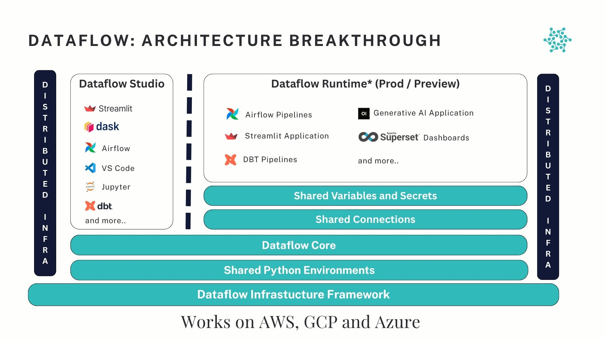

Welcome to **Dataflow**, your all-in-one platform for building, deploying, and managing complex data workflows with speed and efficiency.

Dataflow empowers organisations to:

- **Simplify data engineering workflows**  
  Build, test, and deploy scalable data pipelines seamlessly using our intuitive UI and powerful orchestration features.

- **Accelerate analytics and AI projects**  
  Run your data processing, machine learning, and analytics tasks on a unified platform optimised for performance and collaboration.

- **Ensure reliability and scalability**  
  Built on robust cloud-native infrastructure, Dataflow scales effortlessly with your workloads, ensuring minimal downtime and maximum throughput.

## Key Features

- **Unified Platform:** Build, manage, and deploy all your data pipelines, transformations, and machine learning workflows seamlessly within a single integrated platform.

- **Advanced Orchestration:** Design complex workflows with ease, scheduling tasks with precise dependency management and real-time monitoring to ensure reliability at scale.

- **Team Collaboration:** Enable your entire data team to collaborate securely with granular role-based access controls and shared project workspaces.

- **Elastic Compute Scaling:** Automatically scale compute resources to match your workload demands, optimising for both performance and cost-efficiency.

- **Robust Integrations:** Connect effortlessly to your existing data warehouses, data lakes, and external systems to create end-to-end data solutions without integration bottlenecks.

## Dataflow Architecture

Dataflow is built on a **distributed, cloud-native architecture** optimised for scalability, modularity, and ease of use.

*Figure: Dataflow Architecture Overview*

### **Architecture Overview**

**Dataflow Studio**

Includes:

- Streamlit
- Airflow
- VS Code
- Jupyter
- and more...

**Dataflow Runtime (Prod / Preview)**

Supports:

- Airflow Pipelines
- Streamlit Applications
- Generative AI Applications
- Superset Dashboards
- and more...

**Shared Services**

- Shared Variables and Secrets
- Shared Connections

**Core Infrastructure Layers**

- Dataflow Core
- Shared Python Environments
- Dataflow Infrastructure Framework

> **Deployment**: Works seamlessly on **AWS, GCP, and Azure**.

---

## Why Dataflow?

Organisations choose Dataflow to:

- Reduce time-to-insight by streamlining data operations
- Minimise operational overhead with automated scheduling and monitoring
- Enable data scientists and engineers to focus on building value instead of managing infrastructure

## Get Started

Ready to build your first data pipeline?

Head over to our [Access & Onboard](/get-started/access-and-onboarding/) page to sign up and set up your workspace.

---

For questions, visit our [Support & Help](/get-started/support-and-help/) page or contact our team directly.
