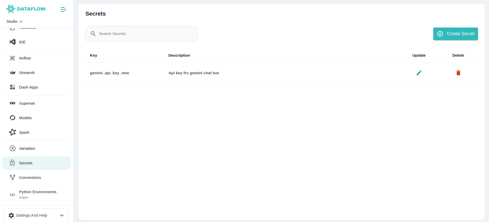
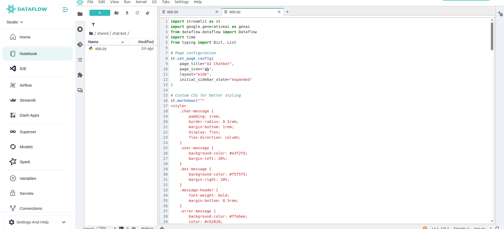
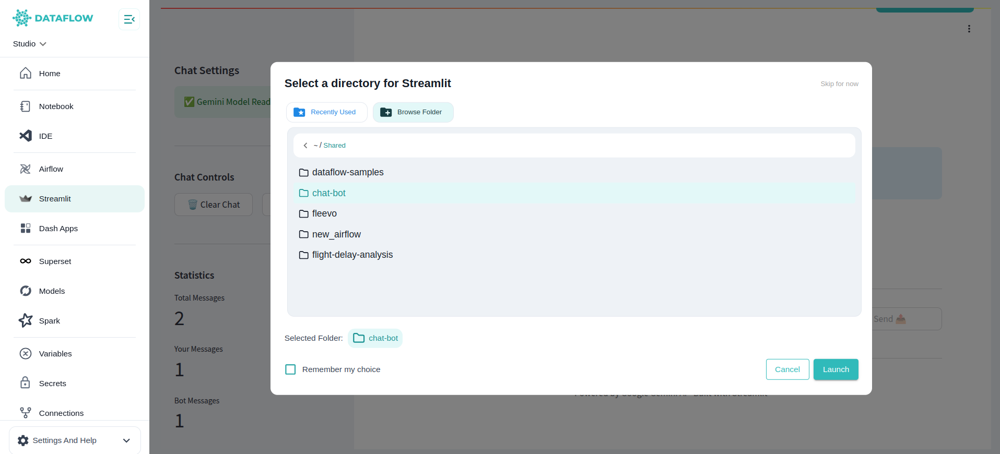
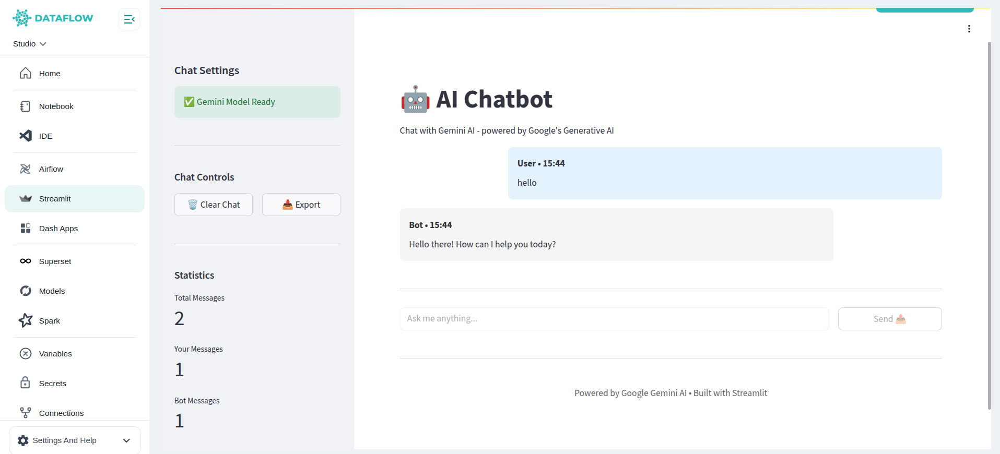

This example shows how to build a simple **AI Chatbot** using **Google Gemini API** with Streamlit on Dataflow. Follow each step to set up secrets, organize your project, and launch it seamlessly.

---

##  Prerequisites

- You have **access to Streamlit** on Dataflow  
- Your **Studio server is running** to use Streamlit  
- You have a valid **Gemini API Key**

---

##  Step 1: Add Your Gemini API Key as a Secret

1. Go to the **Secrets** page in Dataflow settings.  
2. Click **“Add Secret”**.  
3. Enter:
   - **Key Name:** `gemini_api_key`  
   - **Value:** *Your Gemini API Key*  
   - **Description:** *(Optional)*  

4. Click **Save**.  
Your secret will now be stored securely in the platform's secrets manager.

---

##  Step 2: Create Your Chatbot Project Folder

1. Navigate to your **Studio workspace** in VS Code or JupyterLab.  
2. Inside your desired location (e.g., `/jovyan/` or `/jovyan/shared/`), create a new folder named:

3. Inside this `chatbot` folder, create a new file:app.py

```python
import streamlit as st
import google.generativeai as genai
from dataflow.dataflow import Dataflow
import time
from typing import Dict, List

# Page configuration
st.set_page_config(
    page_title="AI Chatbot",
    page_icon="🤖",
    layout="wide",
    initial_sidebar_state="expanded"
)

# Custom CSS for better styling
st.markdown("""
<style>
    .chat-message {
        padding: 1rem;
        border-radius: 0.5rem;
        margin-bottom: 1rem;
        display: flex;
        flex-direction: column;
    }
    .user-message {
        background-color: #e3f2fd;
        margin-left: 20%;
    }
    .bot-message {
        background-color: #f5f5f5;
        margin-right: 20%;
    }
    .message-header {
        font-weight: bold;
        margin-bottom: 0.5rem;
    }
    .error-message {
        background-color: #ffebee;
        color: #c62828;
        border-left: 4px solid #f44336;
    }
    .stTextInput > div > div > input {
        background-color: white;
    }
</style>
""", unsafe_allow_html=True)

@st.cache_resource
def initialize_gemini():
    """Initialize Gemini model with caching for better performance"""
    try:
        dataflow = Dataflow()
        api_key = dataflow.secret("gemini_api_key")
        genai.configure(api_key=api_key)
        
        # Configure generation settings for better responses
        generation_config = {
            "temperature": 0.7,
            "top_p": 0.8,
            "top_k": 40,
            "max_output_tokens": 2048,
        }
        
        model = genai.GenerativeModel(
            "gemini-1.5-flash",
            generation_config=generation_config
        )
        return model
    except Exception as e:
        st.error(f"Failed to initialize Gemini: {e}")
        return None

def display_chat_message(role: str, message: str, timestamp: str = None):
    """Display a chat message with proper styling"""
    css_class = "user-message" if role == "User" else "bot-message"
    
    if "Error:" in message:
        css_class += " error-message"
    
    st.markdown(f"""
    <div class="chat-message {css_class}">
        <div class="message-header">
            {role} {f"• {timestamp}" if timestamp else ""}
        </div>
        <div>{message}</div>
    </div>
    """, unsafe_allow_html=True)

def clear_chat():
    """Clear chat history"""
    st.session_state.messages = []
    st.session_state.chat_started = False

def export_chat():
    """Export chat history as text"""
    if "messages" in st.session_state and st.session_state.messages:
        chat_text = "\n".join([
            f"{msg['role']}: {msg['content']}"
            for msg in st.session_state.messages
        ])
        return chat_text
    return "No chat history to export."

# Initialize session state
if "messages" not in st.session_state:
    st.session_state.messages = []
if "chat_started" not in st.session_state:
    st.session_state.chat_started = False

# Initialize Gemini model
model = initialize_gemini()

# Sidebar
with st.sidebar:
    st.header("Chat Settings")
    
    # Model status
    if model:
        st.success("✅ Gemini Model Ready")
    else:
        st.error("❌ Model Not Available")
    
    st.divider()
    
    # Chat controls
    st.subheader("Chat Controls")
    
    col1, col2 = st.columns(2)
    with col1:
        if st.button("🗑️ Clear Chat", use_container_width=True):
            clear_chat()
    
    with col2:
        chat_export = export_chat()
        st.download_button(
            "📥 Export",
            data=chat_export,
            file_name="chat_history.txt",
            mime="text/plain",
            use_container_width=True
        )
    
    st.divider()
    
    # Statistics
    st.subheader("Statistics")
    message_count = len(st.session_state.messages)
    user_messages = len([m for m in st.session_state.messages if m['role'] == 'User'])
    bot_messages = len([m for m in st.session_state.messages if m['role'] == 'Bot'])
    
    st.metric("Total Messages", message_count)
    st.metric("Your Messages", user_messages)
    st.metric("Bot Messages", bot_messages)

# Main chat interface
st.title("🤖 AI Chatbot")
st.markdown("Chat with Gemini AI - powered by Google's Generative AI")

# Display welcome message if chat hasn't started
if not st.session_state.chat_started and not st.session_state.messages:
    st.info("👋 Welcome! Start a conversation by typing a message below.")

# Chat container
chat_container = st.container()

with chat_container:
    # Display chat history
    for message in st.session_state.messages:
        display_chat_message(
            message['role'], 
            message['content'], 
            message.get('timestamp')
        )

# Initialize message processing flag
if "processing" not in st.session_state:
    st.session_state.processing = False

# Input section
st.divider()

# Create columns for input and button
col1, col2 = st.columns([4, 1])

with col1:
    # Use a unique key that changes to reset the input
    input_key = f"user_input_{len(st.session_state.messages)}"
    user_input = st.text_input(
        "Type your message:",
        key=input_key,
        placeholder="Ask me anything...",
        label_visibility="collapsed",
        disabled=st.session_state.processing
    )

with col2:
    send_button = st.button(
        "Send 📤", 
        use_container_width=True, 
        type="primary",
        disabled=st.session_state.processing or not user_input.strip()
    )

# Handle message sending
if send_button and user_input.strip() and model and not st.session_state.processing:
    st.session_state.processing = True
    
    # Add user message
    timestamp = time.strftime("%H:%M")
    user_message = {
        "role": "User",
        "content": user_input.strip(),
        "timestamp": timestamp
    }
    st.session_state.messages.append(user_message)
    st.session_state.chat_started = True
    
    # Show typing indicator
    with st.spinner("🤔 Thinking..."):
        try:
            # Generate response with context awareness
            # Include recent chat history for better context
            context_messages = st.session_state.messages[-10:]  # Last 10 messages
            conversation_context = "\n".join([
                f"{msg['role']}: {msg['content']}" 
                for msg in context_messages[:-1]  # Exclude the current message
            ])
            
            if conversation_context:
                prompt = f"Previous conversation:\n{conversation_context}\n\nUser: {user_input}"
            else:
                prompt = user_input
            
            response = model.generate_content(prompt)
            
            if response.text:
                bot_message = {
                    "role": "Bot",
                    "content": response.text,
                    "timestamp": time.strftime("%H:%M")
                }
                st.session_state.messages.append(bot_message)
            else:
                error_message = {
                    "role": "Bot",
                    "content": "I couldn't generate a response. Please try again.",
                    "timestamp": time.strftime("%H:%M")
                }
                st.session_state.messages.append(error_message)
                
        except Exception as e:
            error_message = {
                "role": "Bot",
                "content": f"Error: {str(e)}",
                "timestamp": time.strftime("%H:%M")
            }
            st.session_state.messages.append(error_message)
    
    # Reset processing flag and rerun
    st.session_state.processing = False
    st.rerun()

elif send_button and not model:
    st.error("❌ Gemini model is not available. Please check your configuration.")

# Footer
st.divider()
st.markdown(
    """
    <div style='text-align: center; color: #666; padding: 1rem;'>
        Powered by Google Gemini AI • Built with Streamlit
    </div>
    """, 
    unsafe_allow_html=True
)
```



Save the file after pasting your code.

 **Step 4: Launch Your Streamlit Chatbot**

In Dataflow, go to the **Streamlit** page from the sidebar.

1. Click “Launch Project” (top-right corner).
2. Choose the **chatbot** folder you just created as your project directory.
3. Click **Launch**.


Dataflow will start your Streamlit app, and your AI Chatbot will be ready to use!

---

**Summary**

- You created and saved your **Gemini API Key** as a secret
- You built your chatbot project in the **chatbot** folder
- You launched it via **Streamlit in Dataflow**

This workflow makes it easy to build interactive AI apps directly in your Dataflow environment with proper secret management and project organization.

