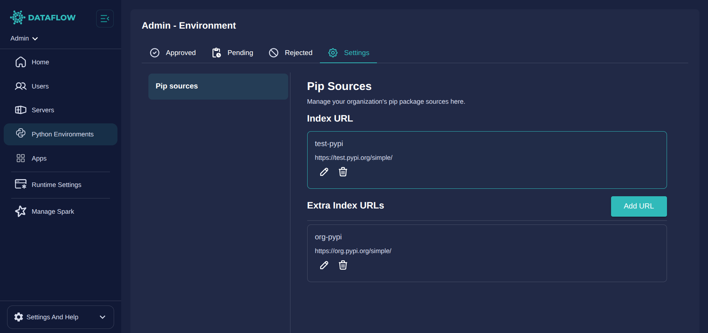

The **Python Environment Approval** process allows Admins to review and control which custom environments are published for use across your workspace. This ensures security, compatibility, and standardisation for all workflows.

---

## What is Environment Approval?

When users create a custom Python environment in Studio, they can:

- **Save it as a draft** for personal use and further editing  
- **Submit it for publishing**, making it available to all users after Admin approval

The Admin review process ensures only tested, secure, and compatible environments are published in the workspace.

---

## Approving or Rejecting an Environment

### 1 Viewing Pending Environments

1. Navigate to **Admin → Python Environments** from the sidebar.  
2. You will see a list of environments needs approval:  

---

### 2 Reviewing Environment Details

Click on the environment name to view:

- **Environment Name and Base Environment**  
- **Creator (user who built it)**  
- **Installed Libraries and Versions** (e.g. pandas==1.3.5, scikit-learn==1.1.3)  
- **Description** (optional notes from the creator)

You can also **compare libraries and versions** with existing published environments to ensure consistency, security compliance, or avoid duplication.

---

### 3 Approving an Environment

- Click **Approve** if the environment meets your workspace standards.  
- The status will change to **Published** and it becomes available for all users in Studio for selection during server launch and in runtimes.

---

### 4 Rejecting an Environment

- Click **Reject** if the environment does not meet requirements or needs modification.  
- The status will revert to **Draft**, and the user can update and resubmit the environment for approval.

---

## Approval Workflow Summary

1. **User creates and builds environment → Saves as draft**  
2. **User submits environment for publishing**  
3. **Admin reviews environment details and libraries**  
4. Admin **approves** ➔ Environment status changes to **Published**  
5. Admin **rejects** ➔ Environment status reverts to **Draft**, user can edit and resubmit

---

## Best Practices

- Approve only environments with **validated, secure, and workspace-compliant libraries**.  
- Reject and provide feedback for environments with outdated or conflicting library versions.  
- Periodically review published environments to deprecate unused ones and maintain a clean, standardised environment list.

---

## Summary

Through the **Python Environment Approval** process, Admins ensure:

- Only verified environments are published and used across the platform  
- Workspace compatibility, security, and cost-efficiency are maintained  
- Users can build custom environments confidently while adhering to governance policies

---

## Managing Pip Sources

As an Admin, you can configure organization-wide pip sources that will be available to all users when building their Python environments. This allows you to set up private package repositories, internal mirrors, or alternative package indexes for the entire workspace.

### What are Pip Sources?

Pip sources define where Python packages are downloaded from during environment builds. You can configure:

- **Index URL:** The primary package source (replaces PyPI as the default)
- **Extra Index URLs:** Additional package sources that complement the main index

### Organization-Level Management

**Benefits of Centralized Control:**
- Ensure all users access approved package repositories
- Configure private or internal package indexes
- Maintain security and compliance across all environments
- Standardize package sources for consistent builds

### Managing Index URL

**Setting a Custom Index URL:**
1. Navigate to **Admin → Environment Settings** from the sidebar
2. In the **Index URL** section, click **"Add Index URL"** if none exists
3. Enter a **Name** for identification (e.g., "Internal PyPI Mirror")
4. Enter the **URL** of your package index (e.g., `https://internal-pypi.company.com/simple`)
5. Click **"Add"** to save

**Editing or Removing Index URL:**
- Click the **pencil icon** to edit the existing index URL
- Click the **trash icon** to remove and revert to PyPI default
- Changes apply to all future environment builds

### Managing Extra Index URLs

**Adding Extra Sources:**
1. In the **Extra Index URLs** section, click **"Add URL"**
2. Enter a **Name** and **URL** for the additional source
3. Click **"Add"** to save

**Managing Existing Sources:**
- **Edit:** Click the pencil icon to modify name or URL
- **Delete:** Click the trash icon to remove the source

### User vs Admin Sources

**Admin (Organization) Sources:**
- Configured by you and visible to all users
- Cannot be modified by individual users
- Automatically included in all environment builds
- Marked as "(Organization)" in user interfaces

**User Sources:**
- Personal extra index URLs added by individual users
- Only visible to the user who created them
- Complement the organization sources you configure
- Users can add, edit, and delete their own sources

### Important Considerations

**Impact on Users:**
- Changes to pip sources affect all new environment builds
- Existing environments are not automatically updated
- Users will see organization sources in their environment settings

