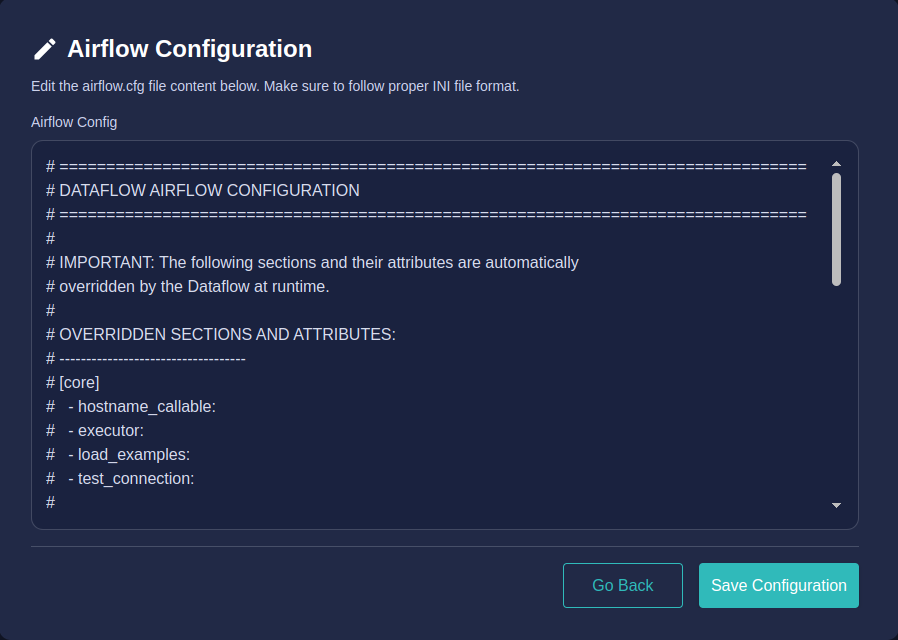

This document explains how to configure Airflow settings for a runtime in Dataflow. Administrators can define custom Airflow configurations during runtime creation or later through the Edit section. Any modifications require the runtime to be stopped before editing.

## When You Can Configure Airflow

Airflow configuration can be applied in two scenarios:

1. **During Runtime Creation**  
   When creating an Airflow-based project, you can provide a airflow config as part of the setup.

2. **After Creation (Edit Section)**  
   You may modify configurations later through the Edit option.  
   To enable editing:  
   - The Airflow runtime must be stopped.  
   - Changes can only be saved while the server is not running.  
   - Editing is blocked while the runtime is active.

:::note
The following sections and their attributes are automatically
overridden by the Dataflow at runtime.
:::

## Auto-Overridden Settings (Do Not Edit)

The following sections and attributes are always controlled by Dataflow at runtime. Any changes made to them will be ignored:

- **[core]**  
  - hostname_callable  
  - executor  
  - load_examples  
  - test_connection  

- **[database]**  
  - load_default_connections  

- **[webserver]**  
  - base_url  
  - web_server_host  
  - authenticate  
  - rbac  
  - xframe_enabled  
  - enable_proxy_fix  
  - proxy_fix_*  

- **[secrets]**  
  - backend  

These values ensure deployment consistency and workspace security.

## Editing Workflow

### Add or Modify Configuration During Creation

1. Go to **Admin → Runtimes**.  
2. Select **Create Project**.  
3. Choose **Airflow** as the runtime.  
4. After creation click update Airflow config and update configuration in the relevant field.

### Update Configuration After Creation

1. Go to the specific Airflow project.  
2. click Three dots
3. Select **details**.  
4. Select **Edit**.  
5. click update Airflow config and update configuration in the relevant field.  
6. Save changes and start the project.  

## Best Practices

- Add only supported sections under the user customization area.  
- Avoid modifying system-managed attributes.  
- Keep configurations minimal and scoped to your workflows.  
- Always cross-check with official Airflow references before applying changes.  

**Documentation reference**:  
https://airflow.apache.org/docs/apache-airflow/2.10.5/configurations-ref.html

## Summary

Airflow configuration in Dataflow supports controlled customization while preserving platform-managed stability:  
- Configuration is allowed during creation or in Edit mode after stopping the runtime.  
- System-managed attributes are automatically overridden.  
