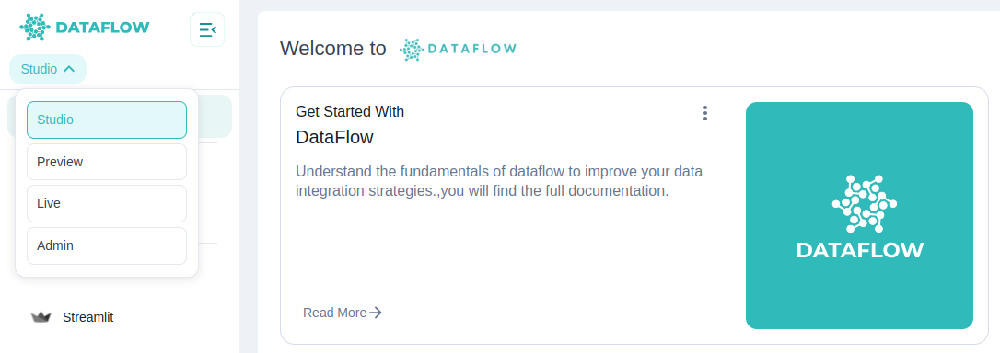

Your **Workspace** is the unified environment where you can build, deploy, and manage all your data workflows securely and efficiently. It is divided into three primary areas: **Studio**, **Runtime**, and **Admin**.

---

## Workspace Areas

### 1. Studio

The **Studio** is your interactive development and workflow design environment.

In Studio, you can:

- **Create DAGs:** Design and define data workflows using Airflow  
- **Develop Visualisations:** Build interactive apps and dashboards with Streamlit  
- **Manage Python Environments:** Create and approve custom Python environments for your pipelines and notebooks  
- **Set Variables, Connections, and Secrets:** Manage configuration securely for your workflows  
- **Connect to Git Repositories:** Use version control for notebooks and scripts  
- **Develop in Notebooks and IDE:** Create, edit, and run notebooks for data exploration and model development

**Note:** All development and workflows in Studio run on the **Studio server**, ensuring an integrated and consistent environment for your team.

---

### 2. Runtime

The **Runtime** area provides visibility into your execution environments.

In Runtime, you can:

- **View Projects Running:** Monitor active projects and their statuses  
- **See Pinned and Recent Projects:** Quickly access your pinned favourites and recently opened projects for efficiency

**Note:** Runtime is read-only; users cannot modify or control runtimes directly here. All executions are managed through pipelines and orchestrators configured in Admin.

---

### 3. Admin

The **Admin** area is your workspace management console.

In Admin, you can:

- **Manage Users and Access:** Add or remove users, assign roles, and manage team permissions  
- **Create Runtime Projects:** Provision and configure projects in different runtimes (e.g. Airflow, Spark)  
- **Manage Studio Server Access:** Control which users have access to Studio features  
- **Approve Python Environments:** Review and approve environments created by users in Studio  
- **Manage Teams and Roles:** Define team structures, roles, and permissions  
- **Manage App access:** Define App access for users  
- **Monitor Metrics:** View workspace usage and performance metrics for optimised operations

---

## Switching Between Areas

You can easily switch between **Studio**, **Runtime**, and **Admin** using the workspace area switcher at the top of your interface.

**Tip:** Switching ensures you are always working in the correct context, whether developing workflows, monitoring executions, or managing users and settings.

---

## Summary

Your workspace areas provide:

- **Studio:** A development hub to create, build, and manage workflows and environments  
- **Runtime:** A monitoring console to track running projects and jobs  
- **Admin:** A management console to control users, runtimes, environments, and overall workspace configuration

Explore each area in detail in the following documentation sections to unlock the full capabilities of your platform.
