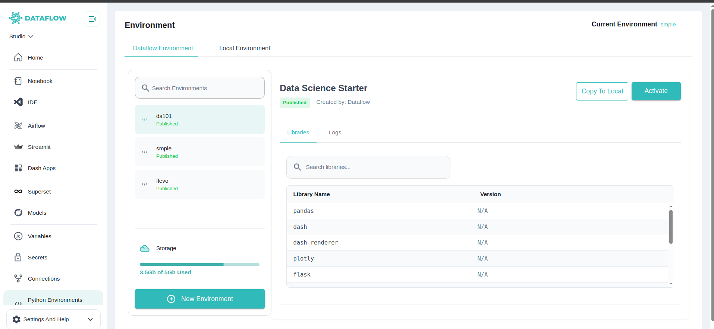
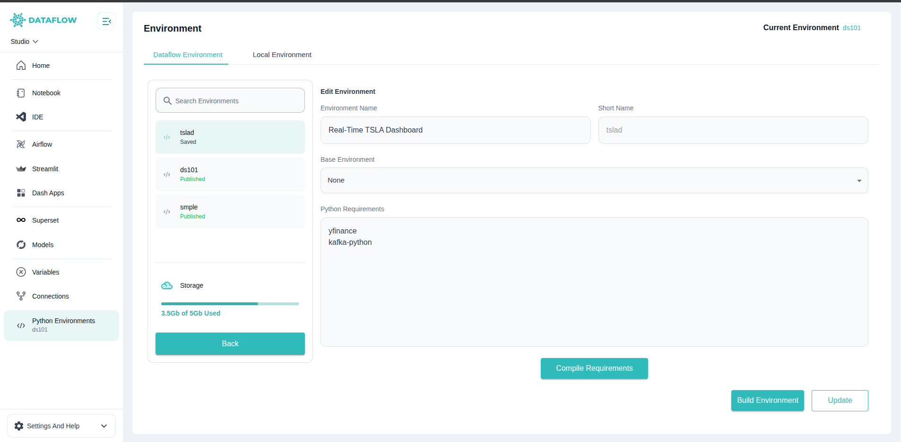
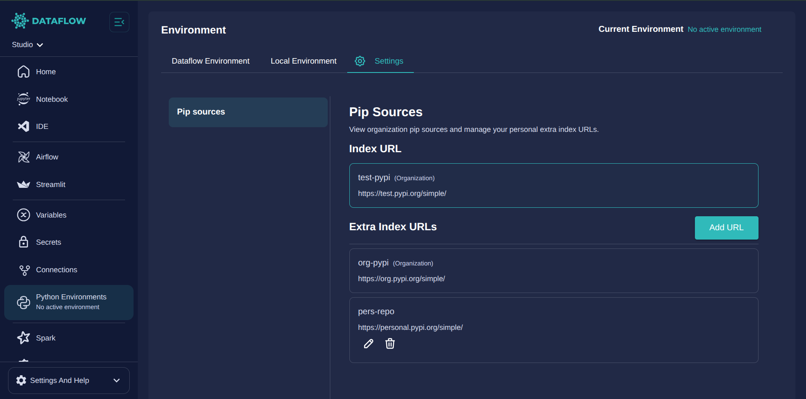

The **Environments** section in Studio allows you to create, build, manage, and activate custom Python environments tailored to your workflows and apps. These environments ensure consistency, reproducibility, and compatibility for your data engineering and data science projects.

---

##  What are Environments?

An **Environment** is a Python setup with specific libraries and versions. It defines the exact dependencies your notebooks, pipelines, and apps require.

- Avoid version conflicts  
- Ensure reproducibility across team members  
- Optimise resource usage by installing only what is needed

---

## Creating a New Environment

Follow these steps to create a new environment:

1. **Click "New Environment":** Opens the environment creation form  
2. **Enter Details:**  
   - **Short Name:** A quick identifier (e.g. `ml-env`)  
   - **Full Name:** Descriptive name (e.g. `Machine Learning Environment`)  
   - **Base Environment:** Choose a base image (e.g. `python:3.10`)  
3. **Add Libraries:** List required libraries with specific versions (e.g. `pandas==1.5.3`, `scikit-learn==1.3.0`)

4. **Click "Save":** Saves your environment in **Saved** state

5. **Click "Build":** Initiates the build process to install the specified libraries and prepare your environment image

---

##  Environment Status Flow

Environments move through these statuses:

- **Saved:** Initial state after creation  
- **Draft:** Built successfully and ready for use or publishing  
- **Published:** Approved by Admin and available to all users  

---

###  **Build & Approval Process**

1. After clicking **Build**, your environment is queued for build on backend servers  
2. If the build is successful, it moves to **Draft** state  
3. From **Draft**, you can:

   - **Use it yourself:** Activate in your Studio sessions  
   - **Submit for Publish:** Sends the environment to Admin for approval

4. If **Approved by Admin**, it moves to **Published** and becomes available to all workspace users  
5. If **Rejected**, it moves back to **Draft**, and you can edit or re-submit after corrections

---

---

## Activating an Environment

You can **activate an environment** in your Studio server if it is in:

- **Draft** state (private use)  
- **Published** state (shared use)

>  **Note:** Activation is not possible for environments still in **Saved** state or if the build has failed.

---

## Checking Build Logs

For each environment, you can:

- View **build logs** to troubleshoot installation failures  
- Monitor **build progress** live for long installations

---

## Local vs Dataflow Environments

In your Notebook interface, you will see two categories:

- **Local Environments:** Kernels created and managed within your current Notebook server session only  
- **Dataflow Environments:** Studio-wide environments created in this Environments page, accessible across notebooks and apps

### Copying Between Local and Dataflow

- **Copy to Local:** Import a Dataflow Environment to use as a local kernel  
- **Copy to Dataflow:** Promote a Local Environment to a Studio-wide Dataflow Environment for reuse and collaboration

---

## Pip Sources Management

The **Pip Sources** feature in the Environment Settings allows you to manage custom Python package sources for your personal use. This is particularly useful when you need to install packages from private repositories or alternative package indexes.

### Organization vs User Level Sources

**Organization Level Sources:**
- Configured by administrators for the entire workspace
- Automatically available to all users
- Cannot be modified by individual users
- Displayed with "(Organization)" label for identification

**User Level Sources:**
- Personal extra index URLs that you can add and manage
- Only visible and usable in your environments
- You have full control to add, edit, and delete these sources
- Complement the organization-level sources

### What You Can Do

As a user, you can:

1. **View Organization Sources:** See all pip sources configured by your administrator
2. **Add Personal Extra Index URLs:** Add your own private or additional package sources
3. **Edit Your Sources:** Modify the name and URL of sources you created
4. **Delete Your Sources:** Remove sources you no longer need

### Managing Your Pip Sources

**To Add a New Source:**
1. Click **"Add URL"** in the Extra Index URLs section
2. Enter a **Name** for easy identification (letters, digits, hyphens, and underscores only)
3. Enter the **URL** of your package index (e.g., `https://your-private-repo.com/simple`)
4. Click **"Add"** to save

**To Edit an Existing Source:**
1. Click the **pencil icon** next to the source you want to edit
2. Modify the name or URL as needed
3. Click **"Update"** to save changes

**To Delete a Source:**
1. Click the **trash icon** next to the source you want to remove
2. Confirm the deletion in the dialog that appears

### Important Notes

- Only sources you created can be edited or deleted
- Organization sources are read-only and managed by administrators
- Changes to pip sources are automatically applied to new environment builds
- Your personal sources are private and not visible to other users

---

##  Summary

1. **Create a new environment** by defining name, base image, and libraries  
2. **Save and Build** to install dependencies  
3. **Check build status** and logs for success or errors  
4. **Activate the environment** in Studio once in Draft or Published state  
5. **Submit for Publish** to share with all users upon Admin approval  
6. **Manage local and Dataflow environments** for flexible development workflows

---

By managing your environments effectively, you ensure robust, reproducible, and optimised workflows across your data projects. Explore the next sections on **Connections and Secrets** to integrate external data systems securely within your environment.
