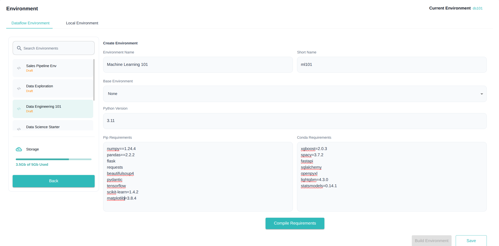
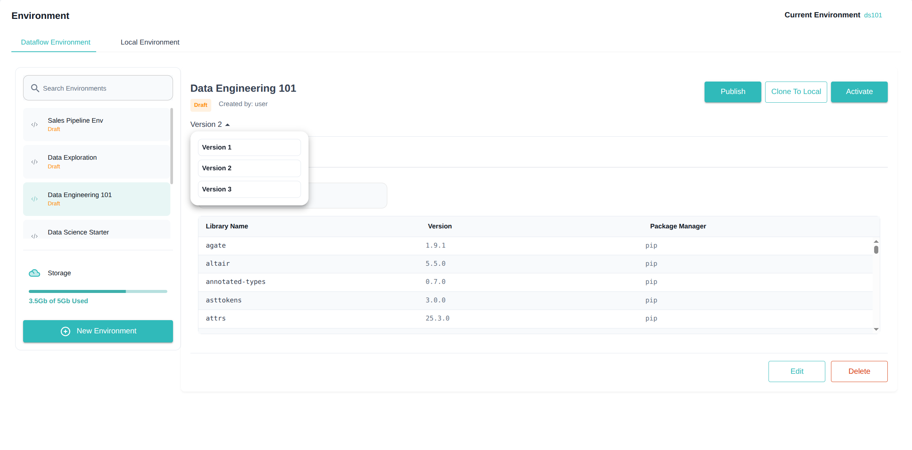

The **Environments** section in Studio allows you to create, build, manage, and activate custom Python environments tailored to your workflows and apps. These environments ensure consistency, reproducibility, and compatibility for your data engineering and data science projects.

---

##  What are Environments?

An **Environment** is a Python setup with specific libraries and versions. It defines the exact dependencies your notebooks, pipelines, and apps require.

- Avoid version conflicts  
- Ensure reproducibility across team members  
- Optimise resource usage by installing only what is needed

---

## Creating a New Environment

Follow these steps to create a new environment:

1. **Click "New Environment":** Opens the environment creation form  
2. **Enter Details:**  
   - **Short Name:** A quick identifier and maximum length should be 5 (e.g. `mlenv`)  
   - **Full Name:** Descriptive name (e.g. `Machine Learning Environment`)  
   - **Base Environment:** Choose a base environment and if it is set as `None` then no base image is chosen and you need to mention python version
   - **Python Version:** Only available if no base environment (`None`) is chosen
3. **Add Libraries:** 
   - **Conda Libraries:** Mention the conda libraries that needs to be installed.
   - **Pip Libraries:** Mention the pip libraries that needs to be installed.

> **Note:** The requirements for both `pip` and `conda` should follow one of the following formats:
>     • `library`
>     • `library=version`
>     • `library==version`
>     • `library<=version`
>     • `library>=version`
>     Also library[dependencies] format with any of the above is allowed.

4. **Click "Save":** Saves your environment in **Saved** state

5. **Click "Build":** Initiates the build process to install the specified libraries and prepare your environment image

>  **Note:** The **short name** is unique across an organization. If a short name is rejected then it is used by someone else so try a different one
---

---

##  Environment Status

Environments will have one of these statuses:

- **Saved:** Initial state after creation  
- **In Progress**: When the build process is undergoing
- **Draft:** Built successfully and ready for use or publishing  
- **Failed:** Build failed due to some reason
- **Published:** Approved by Admin and available to all users

---

## Environment Versioning

Studio provides versioning for environments to track changes and maintain build history:

- When you first build an environment, **Version 1** is created
- A version dropdown appears below the environment name showing all available versions
- Each subsequent build creates a new version (1, 2, 3, etc.)
- Selecting a version from the dropdown displays libraries and logs specific to that version

### Version Behavior and Rules

- **Latest Version Only:** While you can view all versions for audit purposes, only the latest successful version is available for activation or publishing
- **Library Management:** 
  - New libraries in requirements will be installed in new versions
  - Libraries removed from requirements may still remain in the environment
  - Version changes to existing libraries are not guaranteed to take effect
- **Revert Option:** You can revert to a previous version, which creates a new version identical to the one you're reverting to
- **Failed Builds:** 
  - If a build fails then the status will be shown as the same. Only the latest version can be in failed state.
  - Failure logs are available for troubleshooting
  - The environment remains on the last successful version for use
  - When errors are fixed and built again, the same failed version will update with the new status and logs.
- **Approval Process:** When requesting approval for an environment, all failed versions are permanently deleted, and only the last successful draft version is submitted for admin approval

---

###  **Build & Approval Process**

1. After clicking **Build**, your environment is queued for build on backend servers 
2. During building the environments's will be in "In Progress" state and during this time it will be unusable until the build completes. 
2. If the build is successful, it moves to **Draft** state  
3. From **Draft**, you can:

   - **Use it yourself:** Activate in your Studio sessions  
   - **Submit for Publish:** Sends the environment to Admin for approval

4. If **Approved by Admin**, it moves to **Published** and becomes available to all workspace users  
5. If **Rejected**, it moves back to **Draft**, and you can edit or re-submit after corrections

---

---

## Activating an Environment

You can **activate an environment** in your Studio server if it is in:

- **Draft** state (private use)  
- **Published** state (shared use)

>  **Note:** Activation is not possible for environments still in **Saved** state or if it does not have atleast one successful build.

---

## Checking Build Logs

For each environment, you can:

- View **build logs** to troubleshoot installation failures  
- Monitor **build progress** live for long installations

---

## Local vs Dataflow Environments

In your Notebook interface, you will see two categories:

- **Local Environments:** Kernels created and managed within your current Notebook server session only  
- **Dataflow Environments:** Studio-wide environments created in this Environments page, accessible across notebooks and apps

### Copying Between Local and Dataflow

- **Copy to Local:** Import a Dataflow Environment to use as a local kernel  
- **Copy to Dataflow:** Promote a Local Environment to a Studio-wide Dataflow Environment for reuse and collaboration

---

##  Summary

1. **Create a new environment** by defining name, base image, and libraries  
2. **Save and Build** to install dependencies  
3. **Check build status** and logs for success or errors  
4. **Activate the environment** in Studio once in Draft or Published state  
5. **Submit for Publish** to share with all users upon Admin approval  
6. **Manage local and Dataflow environments** for flexible development workflows

---

By managing your environments effectively, you ensure robust, reproducible, and optimised workflows across your data projects. Explore the next sections on **Connections and Secrets** to integrate external data systems securely within your environment.
