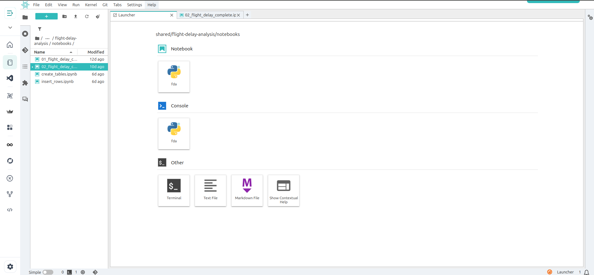
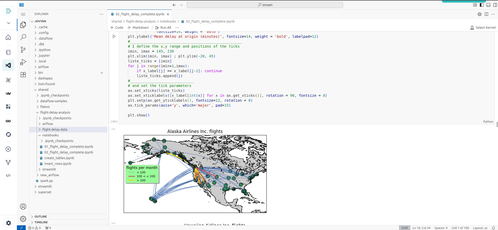

The **Data Exploration & Engineering** section is your dedicated workspace for exploring datasets, building data pipelines, developing models, and deploying analytical or ML applications efficiently.

Studio integrates powerful tools such as **Notebooks, VS Code IDE, Streamlit, Dash, Airflow, and MLFlow** within a unified environment, enabling seamless transitions from data exploration to robust production workflows.

---

## Jovyan Volume

All apps within Studio – including Notebooks, VS Code, Streamlit, Dash, and others – are connected to a **Jovyan volume**.

### **What does this mean for you?**

- Files created or saved in Notebooks are instantly accessible in VS Code and vice versa  
- ML models trained in Notebooks can be used directly in Streamlit or Dash apps for visualisation  
- Enables a **unified file system**, eliminating the need to re-upload or duplicate data across apps

---

##  Using Activated Environments in Notebooks

When you **start your Studio server** and select a **Python environment**, that environment is:

- **Automatically activated** within your Notebook kernel  
- Preloaded with all required libraries for your workflows

This ensures your development experience is **consistent, efficient, and ready-to-use** without manual activation.

You can also **switch to a different Python environment** anytime from the **Environments** page if your workflow requires different dependencies.

---

> 📝 **Notebook Example:** The image above shows an active Jupyter Notebook running in your selected environment, ready for data exploration, processing, or ML tasks.

---

##  Developing with VS Code IDE

Studio includes an integrated **VS Code IDE** that connects to the same shared volume. You can:

- Develop scripts, modules, and packages  
- Build and manage pipeline scripts efficiently  
- Access all your files created in Notebooks directly within VS Code

---

> 💡 **IDE Example:** The above screenshot shows VS Code within Studio, enabling powerful development workflows with direct access to your shared files and environments.

---

## 🔗 Git Integration via SSH

Studio supports **secure Git integration via SSH keys**, enabling you to:

- Clone repositories to your shared Jovyan volume  
- Push changes to remote repositories securely  
- Manage version control efficiently for all notebooks, scripts, and projects

> 💡 **Tip:** Configure your Git SSH keys in the **Git Integration** section before cloning or pushing code to ensure seamless connectivity.

---

## ✅ **Best Practices**

1. Organise your files within structured folders for easy navigation across apps  
2. Check the **activated kernel** in Notebooks matches your selected Python environment  
3. Switch environments as needed from the **Environments page** for different workflows  
4. Configure **Git SSH keys** before cloning or pushing to repositories  
5. Stop your server when not in use to optimise resource costs  
6. Use version control (Git) for collaborative, secure, and reproducible development workflows

---

Explore the next section on **Workflows (Airflow DAGs)** to automate your data processing and pipeline orchestration seamlessly.
