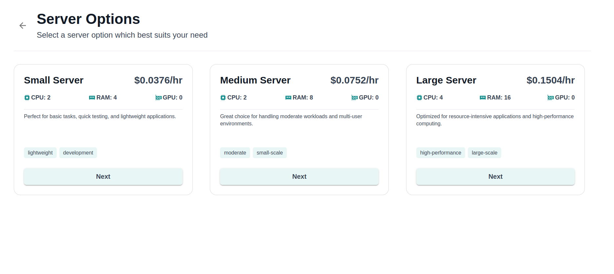
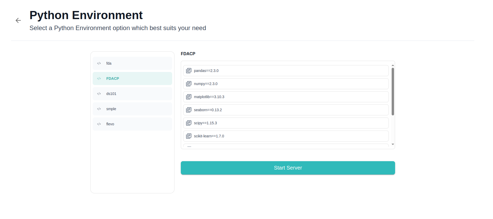

After logging into Studio, you will be prompted to **start your development server**. This ensures that all your workflows, notebooks, and applications run within a secure and isolated environment tailored to your resource needs.

---

## Home or Start Studio Server

Upon login, you will see an option to:

- **Go to Home:** Navigate to your workspace dashboard to access recent and pinned projects, documentation, and announcements.
- **Start Studio Server:** Launch your interactive development server to begin working on notebooks, pipelines, models, and apps.

If you have used Studio previously, the platform will automatically display your **last used server configuration and Python environment** for quick resumption.

---

## Choosing a Server

If no default server is set, or if you want to start a new session, Studio will display a list of **available server configurations**. Each option includes:

- **Server Name:** The name or type of the server configuration
- **CPU, GPU, and Memory Specs:** Details of the compute resources provisioned for the server
- **Cost Per Hour:** Estimated hourly cost to help you choose based on your budget and workload needs

This flexibility ensures you can select lightweight servers for data exploration or GPU-enabled high-memory servers for ML training and intensive computation tasks.

---

---

## Selecting a Python Environment

After choosing your server, you will be prompted to **select a Python environment**. Each environment displays:

- **Environment Name:** Custom name defined when created  
- **Installed Libraries and Versions:** Key libraries pre-installed in the environment for compatibility

The selected environment is **automatically activated** on the server once it starts, ensuring your notebooks, scripts, and pipelines run with the correct dependencies.

> **Tip:** You can switch environments later using the **Environments** section in Studio if your workflow requires a different setup.

---

---

## Server Start Time

Starting a server generally takes between **3 to 7 minutes**, depending on:

- Selected compute specs  
- Current cluster load  
- Environment initialisation time

You will see a loading screen in the apps during this process, and apps will start to run automatically once your server is ready for use.

---

## Changing or Stopping Your Server

  To stop your server and save costs, you currently need to log out of Studio, which will automatically terminate your active server session. All your files, notebooks, and configurations remain safely saved within your workspace storage, so you can resume work seamlessly the next time you log in.

:::caution
If your server status is **“Not Running”** or **“Pending”**, some features like activation of environments, connections, or apps may not function correctly. Always wait for the server to be **fully running** before using notebooks, IDE, workflows, or visualisation tools to ensure a seamless and error-free experience.
:::

## Summary

1. Login and choose **Start Studio Server**  
2. **Select your server configuration** based on resource and cost needs  
3. **Choose your Python environment** with required libraries  
4. Wait **3-7 minutes** for the server to start  
5. Begin developing confidently in your selected environment  
6. Switch environments or change server configurations as your workflows evolve  
7. Always **stop your server** when not in use to manage costs efficiently

---

Explore the next section on **Explore and Engineer Data** to start working with Notebooks and VS Code in your newly launched Studio server.