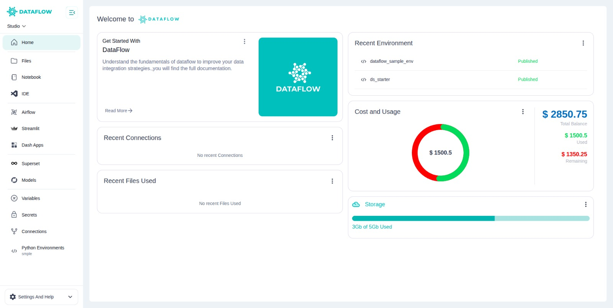

The **Studio** is your interactive development environment where you can build, test, and manage data workflows, pipelines, applications, and machine learning models – all within a single unified workspace. It empowers data engineers, analysts, and scientists to work collaboratively without needing to switch between multiple disconnected tools. With Studio, your team can seamlessly move from development to deployment in an integrated and secure environment, boosting productivity and operational efficiency.

---

---

##  What You Can Do in Studio

###  Notebooks and IDE

The **Notebooks** feature enables you to perform data exploration, cleaning, transformation, and analysis in an interactive way, leveraging Jupyter's intuitive interface. You can visualise datasets, create quick plots, build prototypes for ML models, and document your workflows in the same place.

The integrated **IDE (VS Code)** provides a powerful coding environment directly within Studio, enabling you to build robust data pipelines, develop production-grade scripts, and manage large codebases efficiently. It supports extensions, Git integration, linting, and debugging, offering a complete development experience for your projects.

These two tools combined allow you to switch seamlessly between exploratory notebook work and structured code development, keeping your workflow efficient and organised.

---

###  Workflow Design and Orchestration

Using **Airflow (DAGs)** in Studio, you can create and manage complex ETL pipelines and data workflows with ease. Its visual DAG editor allows you to define task dependencies, schedule executions, and orchestrate end-to-end processes without writing YAML or configuration files manually.

This orchestration capability is critical for automating repetitive data tasks, managing dependencies between different processes, and ensuring data freshness across your systems. With Airflow integrated into Studio, you get full visibility and control over your workflows in the same place where you develop them.

You can also test and validate DAGs interactively before deploying them to production, reducing errors and improving deployment confidence.

---

###  Machine Learning Models

**MLFlow** is integrated within Studio to help you manage the entire machine learning lifecycle efficiently. You can track experiments, compare model runs, and manage model versions all within one interface, ensuring reproducibility and transparency in your ML workflows.

This integration supports registering and deploying models directly from Studio to your production environments or apps. It also allows team collaboration on ML experiments, making it easy to share, review, and approve models before deployment.

By having MLFlow in Studio, data scientists can move seamlessly from training and tuning models to registering and deploying them, eliminating manual tracking and disconnected tools.

---

### Visualisation and Applications

With **Superset**, you can build rich, interactive dashboards to analyse datasets, monitor key metrics, and share insights with stakeholders easily. It supports a wide variety of visualisation types, advanced filtering, and SQL-based data exploration within your workspace.

**Streamlit & Dash** enable you to develop and deploy custom interactive web apps for internal tools, data apps, or business intelligence applications. You can build apps with minimal code and share them instantly with your team for rapid feedback and iteration.

This visualisation ecosystem in Studio ensures that your data insights, ML results, and workflows can be presented in impactful ways for decision-making and operational monitoring.

---

### Python Environments

Studio allows you to **create and activate custom Python environments** tailored to your project requirements. You can specify exact library versions, install dependencies, and ensure consistency across development and production.

This prevents environment mismatch issues that cause pipeline failures or model incompatibility. Approved environments can be reused by your team, promoting standardisation and operational reliability.

Environment management is integrated with notebooks, IDE, workflows, and apps, making it seamless to select and activate the required environment context for each task.

---

### Configurations and Secrets

Managing **variables, connections, and secrets** is centralised within Studio, ensuring your workflows remain secure and configurable. You can define database connections, external API keys, cloud storage credentials, or environment variables securely, without hardcoding them into scripts.

This ensures that sensitive information is managed according to security best practices while keeping your workflows flexible and portable across environments.

Secrets and configurations can be updated centrally, instantly reflecting across your pipelines and applications without requiring code changes, enhancing maintainability and compliance.

---

### Customisable Compute

Studio supports launching your development server with **custom CPU, GPU, and memory configurations**, enabling you to match resource allocation to workload demands. For lightweight data exploration, you can choose a minimal instance, while ML training jobs can leverage GPU-enabled servers.

This flexibility optimises cost while providing the compute performance needed for different tasks. Developers can scale up or down without needing cluster management expertise, focusing purely on their work.

Compute customisation is integrated with the Studio server lifecycle, ensuring resources are used efficiently and responsibly within your workspace.

---

##  Integration and Git Connectivity

Studio integrates all these tools cohesively, making it easy to progress from **data exploration ➔ pipeline development ➔ model tracking ➔ visualisation and deployment** without context switching. All artefacts and workflows are centrally stored and managed, enabling seamless collaboration within your team.

Additionally, you can **connect to Git repositories via SSH keys**, ensuring version control and CI/CD practices are integrated into your workflow. This facilitates code reviews, rollback, and collaborative development following software engineering best practices.

Your Git connection also allows notebooks, pipelines, and app code to be maintained in source control, enabling reproducibility, traceability, and safe deployment workflows.

---

##  Summary Process

1. **Start your Studio server** with the required compute specs for your tasks  
2. **Develop code** in notebooks for quick analysis or VS Code IDE for robust pipelines  
3. **Build and test DAGs** for ETL workflows using Airflow integration  
4. **Train and track models** seamlessly with MLFlow for reproducible ML workflows  
5. **Create dashboards or apps** with Superset, Streamlit, or Dash to visualise results  
6. **Configure environments, variables, connections, and secrets** securely  
7. **Connect to Git** for version control and collaboration workflows  
8. **Run, test, and deploy** your data and ML projects confidently to production

---

Explore each tool in detail in the following Studio documentation to unlock the full capabilities of your platform.
