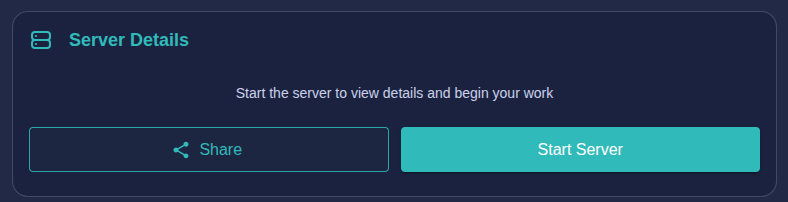
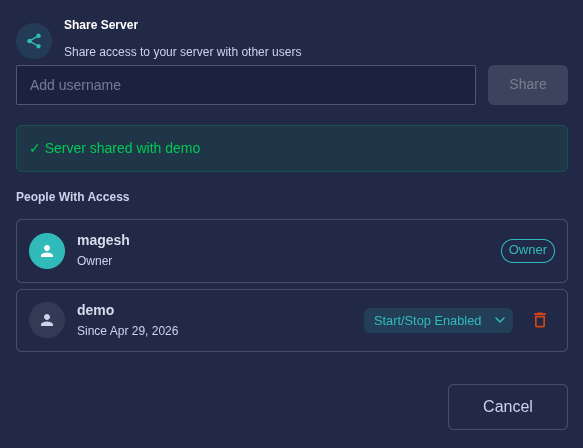
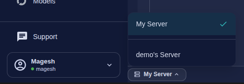

Server Sharing lets you grant colleagues in your organization access to your running Studio server. Shared users can open notebooks, run workflows, and collaborate in real time — all within your server environment.

---

## Sharing Your Server

### Step 1 — Open the Share Dialog

From the Studio home page, locate the **Server Details** panel. Click the **Share** button on the left side of the panel.

### Step 2 — Add a User

In the **Share Server** dialog, type the username of the person you want to share with and click **Share**.

The dialog confirms the share with a success message and the user appears under **People With Access**.

### Step 3 — Set Permissions

For each shared user you can control whether they can start or stop the server:

| Permission | Description |
|------------|-------------|
| **Start/Stop Enabled** | The user can start and stop the server in addition to accessing it |
| **Start/Stop Disabled** | The user can access the server but cannot start or stop it |

Use the dropdown next to the user's name to toggle this permission at any time.

### Removing Access

Click the **delete icon** (trash) next to a user's entry to revoke their access immediately.

:::caution[Organization Scope]
Server sharing is limited to users within your organization. You cannot share a server with users outside your organization.
:::

---

## Accessing a Shared Server

When someone shares their server with you, it becomes available alongside your own server. You can switch between servers at any time without logging out.

### Switching Servers

In the bottom-left corner of Studio, click the **server switcher** — it displays the name of your currently active server (e.g., **My Server**). A dropdown appears listing all servers available to you.

Select any server from the list to switch to it. The active server is indicated with a checkmark. Once switched, all notebooks, files, and tools open within the context of the selected server.

:::tip[Switching Back]
You can switch back to your own server at any time using the same dropdown. Your work on each server is completely independent.
:::

---

## Summary

| Action | Where |
|--------|-------|
| Share your server | Studio home → Server Details → **Share** |
| Add a user | Enter username in the Share Server dialog |
| Set start/stop permission | Dropdown next to the user in the dialog |
| Revoke access | Delete icon next to the user in the dialog |
| Switch to a shared server | Bottom-left server switcher dropdown |
