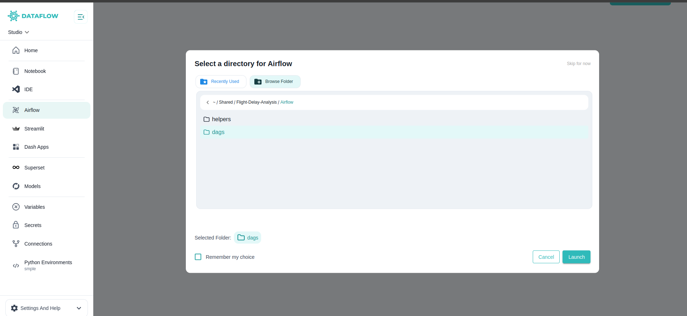

Studio integrates powerful tools like **Streamlit, Dash, and Superset** to enable you to build interactive visualisations, analytical dashboards, and lightweight internal applications – all within your data engineering and ML workflows.

---

##  Why Visualisation Matters

- Communicate insights effectively to stakeholders  
- Build interactive dashboards for real-time data analysis  
- Develop internal tools to streamline operations  
- Deploy lightweight web apps for model inference and data-driven decisions

---

##  Available Tools

###  **Streamlit**

**Streamlit** is an open-source Python framework that lets you build interactive web apps with minimal code.

**Key Features:**

- Rapid prototyping of data apps  
- Supports charts, tables, and model inference interfaces  
- Auto-reloads on script changes for fast iterations

**In Studio:**

- Launch Streamlit by selecting your app folder using the **Launch Directory** feature  
- The app runs in the selected folder, accessing any scripts, models, or data files within your shared and Jovyan volume  
- Reuse the previous working directory for quick re-launch if needed

---

### **Dash**

**Dash** is a Python framework by Plotly for building analytical web applications with rich interactive graphs.

**Key Features:**

- Advanced visualisations powered by Plotly  
- Supports callbacks for interactivity  
- Ideal for deploying analytical dashboards internally

**In Studio:**

- Select the app folder via **Launch Directory** before running Dash  
- Dash uses your shared Jovyan volume for data files, models, or scripts  
- Reuse previous working directories for faster launches

---

### **Superset**

**Apache Superset** is a modern, enterprise-ready data exploration and visualisation platform.

**Key Features:**

- Drag-and-drop dashboard builder  
- SQL-based data exploration and charting  
- Integrates with multiple databases securely

**In Studio:**

- Use Superset to connect to your configured data warehouses or databases  
- Build charts, dashboards, and data exploration queries  
- Accessible via the same Studio server for secure and consistent access

---

##  Launch Directory Feature

For **Streamlit and Dash**, Studio provides a custom **Launch Directory** feature to control where your apps are launched from.

- **Select Folder:** Choose the specific folder containing your app scripts  
- **Reuse Previous:** Quickly use the previously selected folder for faster launches  
- **Default:** If skipped, Studio uses the default app workspace linked to your shared Jovyan volume

---

##  Best Practices

1. Organise each app within its own folder for clarity  
2. Ensure required libraries are installed in your active Python environment  
3. Version control app scripts using Git for collaboration and rollback  
4. Use environment variables or secrets for sensitive configurations  
5. Test locally in Notebooks or VS Code before deploying as apps

---

##  Summary

- **Streamlit:** Rapid data apps with simple Python scripts  
- **Dash:** Analytical dashboards with advanced interactive graphs  
- **Superset:** Drag-and-drop BI dashboards and SQL exploration

All apps are powered by your **shared Jovyan volume** and run within the secure, scalable Studio server environment.

---
