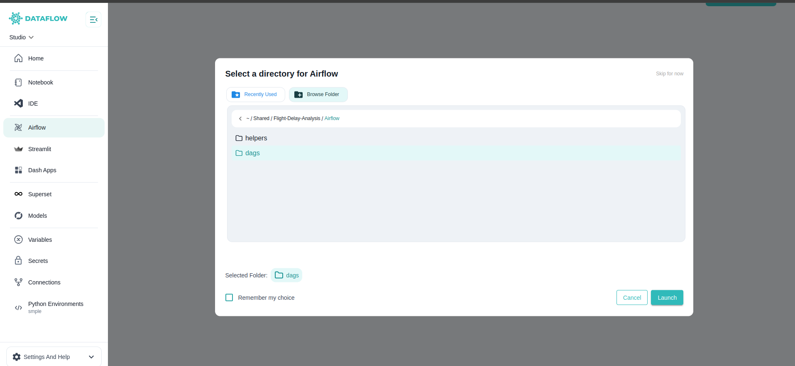

The **Workflows** section in Studio enables you to design, orchestrate, and manage complex data pipelines using **Apache Airflow**, an industry-standard workflow orchestration tool.

---

## What is Apache Airflow?

**Apache Airflow** is a powerful open-source platform for programmatically authoring, scheduling, and monitoring workflows. It allows you to define **DAGs (Directed Acyclic Graphs)** that describe the steps of your data pipeline and their dependencies.

- Automate ETL (Extract, Transform, Load) jobs  
- Manage dependencies between tasks  
- Schedule jobs to run at desired intervals  
- Monitor runs, logs, and task statuses

---

## What is a DAG?

A **DAG** (Directed Acyclic Graph) is a collection of tasks organized in a way that clearly defines execution order and dependencies. Each task represents a step in your workflow — for example, ingesting data, transforming it, and loading it into a data warehouse.

In Studio, you can build and manage DAGs directly from your project folders, version them using Git, and run them using Airflow’s orchestration engine.

---

##  Launch Working Directory

When launching your Airflow environment in Studio, you can use our **custom Working Directory feature** to control where your DAGs are sourced from.

###  How it works:

- **Select a Folder:** Pick the specific folder that contains your DAG files. This makes it easy to test and run only what you need.

- **Use Previous Directory:** If you’ve used Airflow in Studio before, you can quickly launch with your previously selected working directory for faster workflow resumption.

- **Skip & Use Default:** If no directory is selected, Studio will use the default Airflow workspace linked to your shared Jovyan volume.

---

>  **Example:** The image above shows the custom folder selection modal where you can choose your DAG folder or reuse the last working directory.

---

## Running Airflow

Once you launch Airflow, Studio connects your selected DAG folder to the Airflow server.

You can then:

- View all available DAGs in the Airflow UI  
- Trigger DAGs manually or on a schedule  
- Monitor task execution, logs, and dependencies  
- Pause or resume workflows as needed

---

<!--  -->

>  **Example:** The above screenshot shows the Airflow UI inside Studio, where you can monitor DAG runs, task statuses, and logs.

---

##  Airflow Features in Studio

Your integrated Airflow environment in Studio includes:

- **Visual DAG Designer:** Use your IDE or Notebook to define and update DAGs programmatically  
- **Flexible Working Directory:** Organise and isolate DAGs for easier testing and management  
- **Shared Storage:** All DAGs and related scripts stay in the shared Jovyan volume, accessible from VS Code and Notebooks  
- **Secure Execution:** DAGs run inside the controlled Studio server environment  

---

## Best Practices

1. Organise your DAG files in clear project folders  
2. Use descriptive DAG names and clear task dependencies  
3. Use variables, connections, and secrets securely for all data workflows

---

Explore the next sections to learn more about how to build visualisations, deploy apps, and manage your data workflows end-to-end within Studio.
